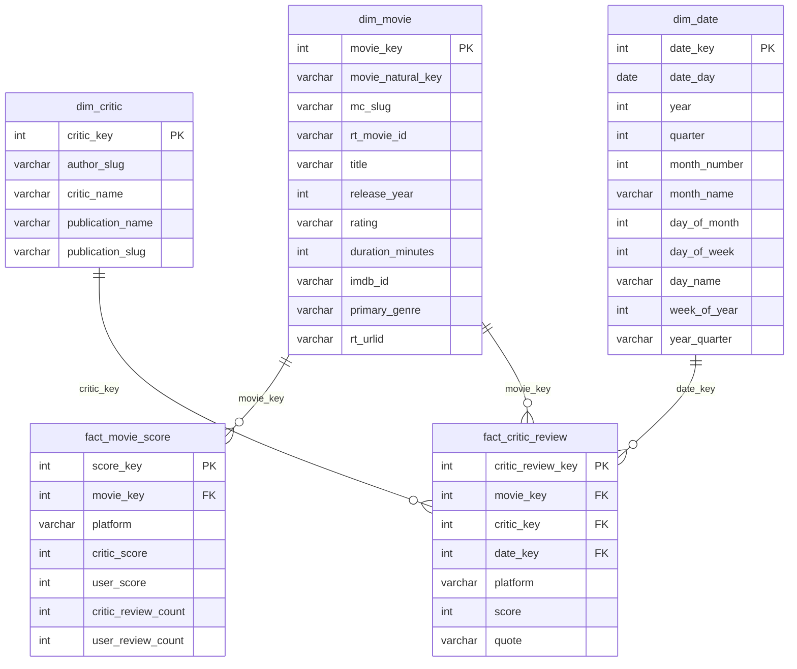

# Gold Layer — Entity-Relationship Diagram

## Notes

- `platform` is either `'metacritic'` or `'rottentomatoes'` in both fact tables.
- `mc_slug` and `rt_movie_id` in `dim_movie` may be NULL for single-source movies (FULL OUTER JOIN between platforms).
- `movie_key`, `critic_key`, and `date_key` FKs in `fact_critic_review` are nullable — unresolvable references produce NULL rather than dropped rows.
- MC user scores are normalised from the 0–10 raw scale to 0–100 (`× 10`). RT audience score is derived from `likedCount / (likedCount + notLikedCount)`.
