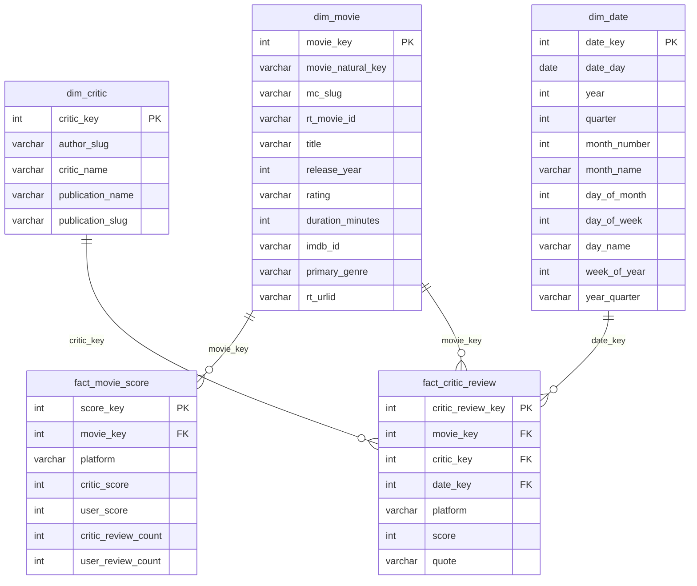

# Camada Gold — Diagrama Entidade-Relacionamento

## Observações

- `platform` é `'metacritic'` ou `'rottentomatoes'` em ambas as tabelas fato.
- `mc_slug` e `rt_movie_id` em `dim_movie` podem ser NULL para filmes de fonte única (FULL OUTER JOIN entre plataformas).
- As FKs `movie_key`, `critic_key` e `date_key` em `fact_critic_review` são anuláveis — referências não resolvidas geram NULL em vez de descartar a linha.
- As notas de usuário do MC são normalizadas da escala bruta 0–10 para 0–100 (`× 10`). A nota do público do RT é derivada de `likedCount / (likedCount + notLikedCount)`.
